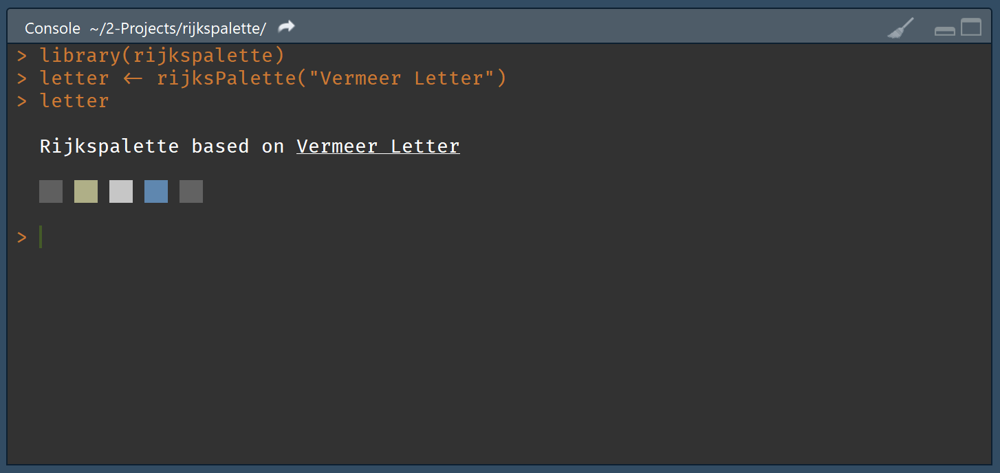
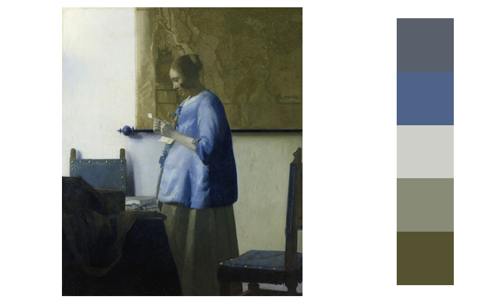
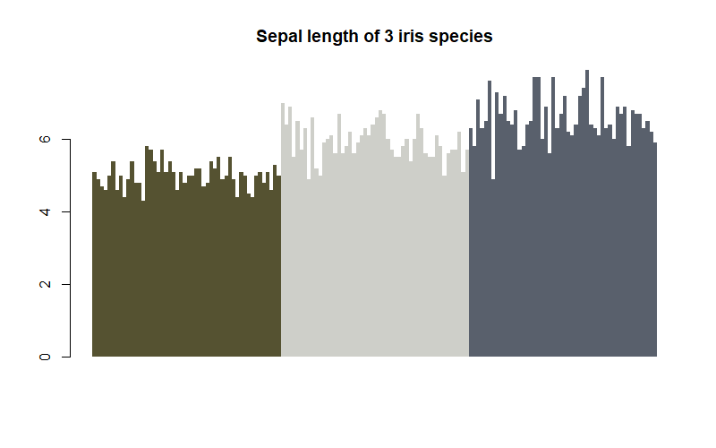
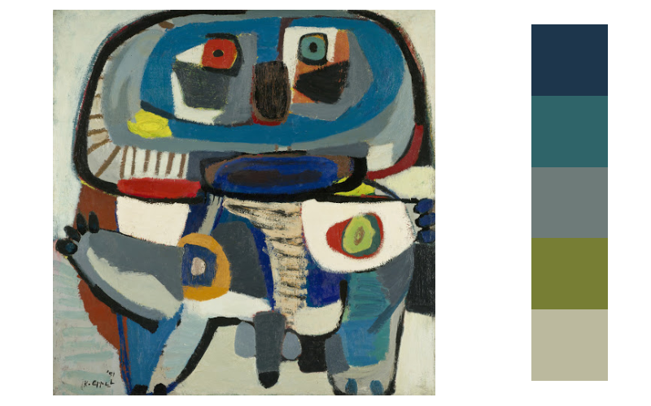
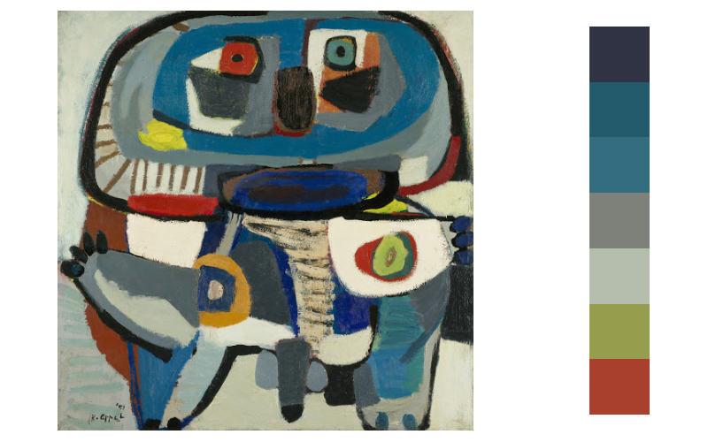
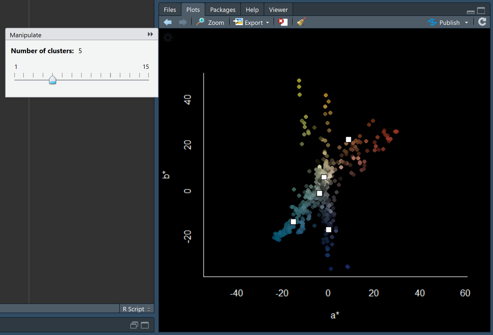
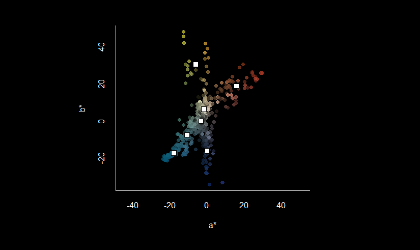
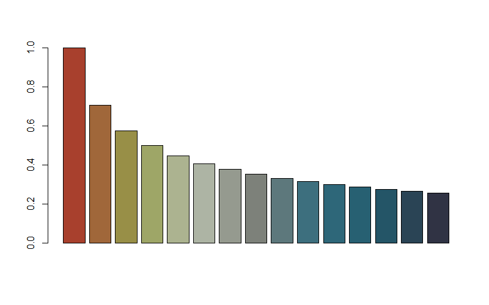

<p align="center">
  </img>
  <p align="center">
    <a href="https://travis-ci.org/vankesteren/rijkspalette"></a>
    <!-- <a href="https://cran.r-project.org/package=Massign"></a>
    <a href="https://cran.r-project.org/package=Massign"></a> -->
  </p>
</p>


### What is this
An R package to generate palettes based on famous paintings from the Rijksmuseum, using the fantastic [Rijksmuseum API](http://rijksmuseum.github.io/).

```R
# Install the development version:
devtools::install_github("vankesteren/rijkspalette")
```

### How to use

Let's make a barplot using a palette based on [Vermeer's famous painting of a woman reading a letter](https://www.rijksmuseum.nl/en/search/objects?q=vermeer+letter&p=1&ps=12&st=Objects&ii=0#/SK-C-251,0). The `rijksPalette()` function queries the collection of paintings of the [Rijksmuseum in Amsterdam](https://www.rijksmuseum.nl).
```R
library(rijkspalette)
letter <- rijksPalette("Vermeer Letter")
letter
```

A 16-bit impression of the palette is shown in the `R` console.



Let's look at the palette a bit better:

```R
plot(letter)
```



Now we can make a plot using the palette from these colours.

```R
barplot(iris$Sepal.Length,
        col = letter$palette(3)[iris$Species],
        border = NA, space = 0,
        main = "Sepal length of 3 iris species")
```


Note that the `palette()` function performs interpolation: you can generate any number of colours!
```R
barplot(rep(1, 1500),
        col = letter$palette(1500),
        border = NA, space = 0,
        axes = FALSE, asp = 1)
```


__Try it out for yourself! Post your palette on twitter with the `#rijkspalette` hashtag :thumbsup:__

<br/>


<br>

### Details: tuning, exploring, and clustering
The palette works well for the above image. However, when a painter uses many colours, some prominent colours may be skipped:

```R
appel5 <- rijksPalette("Karel Appel")
plot(appel5)
```


Here, the quite prominent red colour is skipped. Luckily, we can tune both the number of colours and the brightness of those colours:

```R
appel7 <- tune(appel5, brightness = 0.85, k = 7)
plot(appel7)
```



That's better. But why? The `explore()` function can give us more detail:

```R
explore(appel)
```


Here, we see the colours in the image plotted on the [`a*b*` space](https://en.wikipedia.org/w/index.php?title=Lab_color_space&oldid=830722208). The white squares are the cluster centroids used to generate the palette. Note that the two quite distinct arms in the top of the plot belong to the same cluster. By increasing the number of clusters (the number of colours in the palette), we can fix this issue:



The better coverage of the colour space indicates that 7 clusters is better than 5. The `k` argument in the `tune()` function takes care of that.

To access the individual colours, use the `cols` slot:

```R
appel$cols

[1] "#A8402D" "#969D4C" "#B5BDAC" "#7D817A" "#336D7F" "#235B6D" "#303344"
```

As before, the `palette` slot is a `colorRampPalette` function to be used in plots:

```R
barplot(1/sqrt(1:15), col = appel$palette(15))
```


